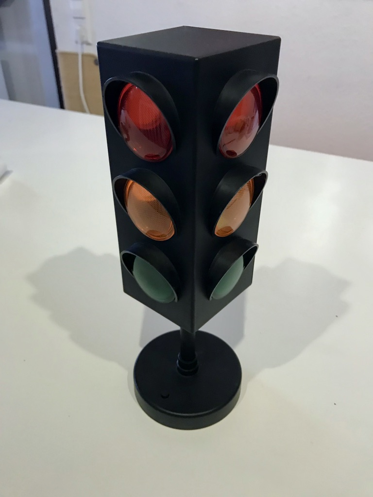
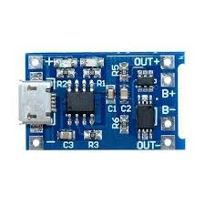
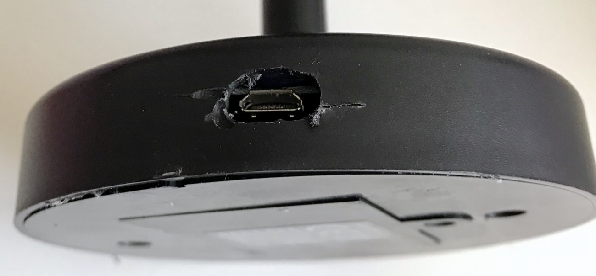
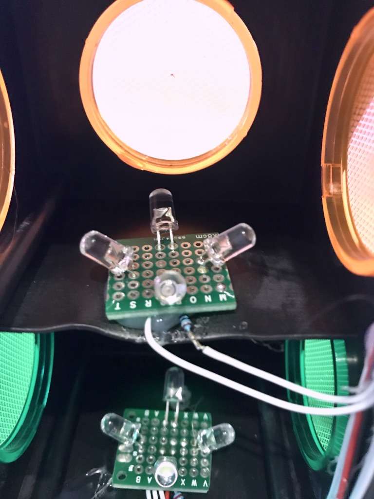
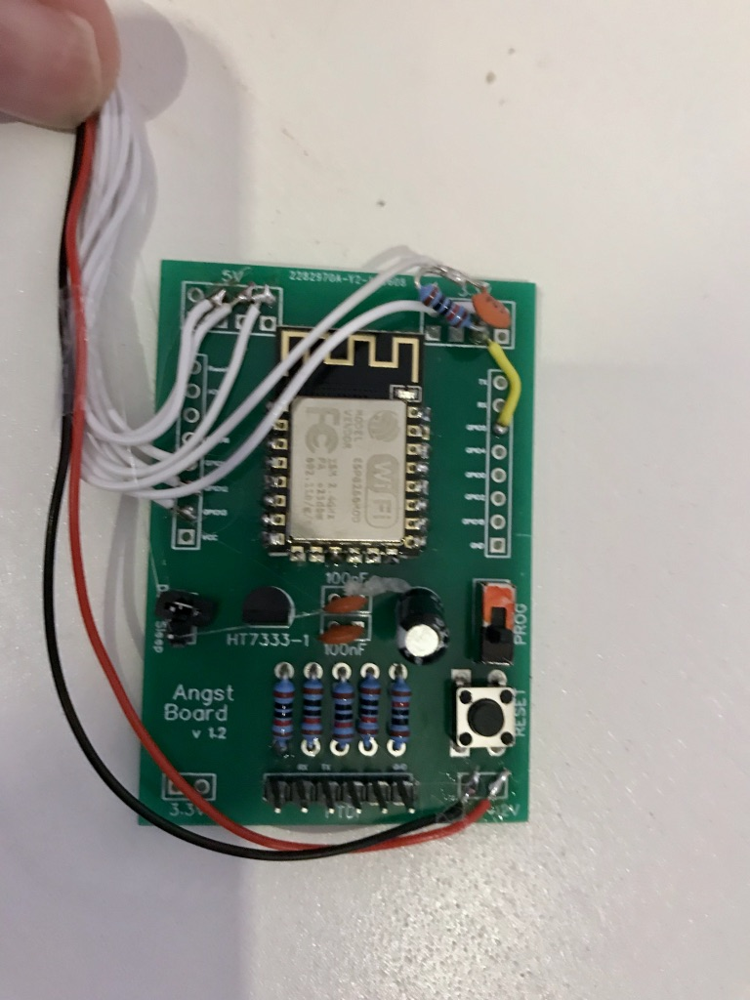
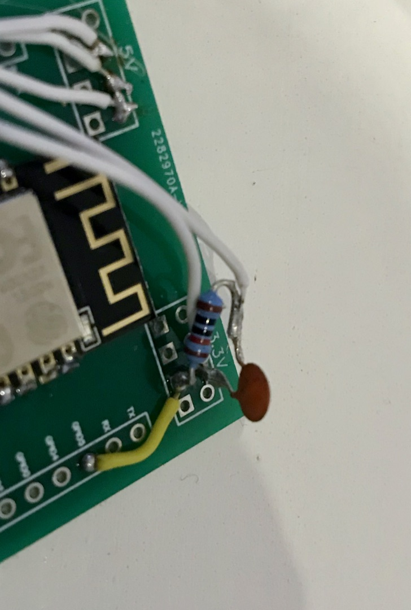
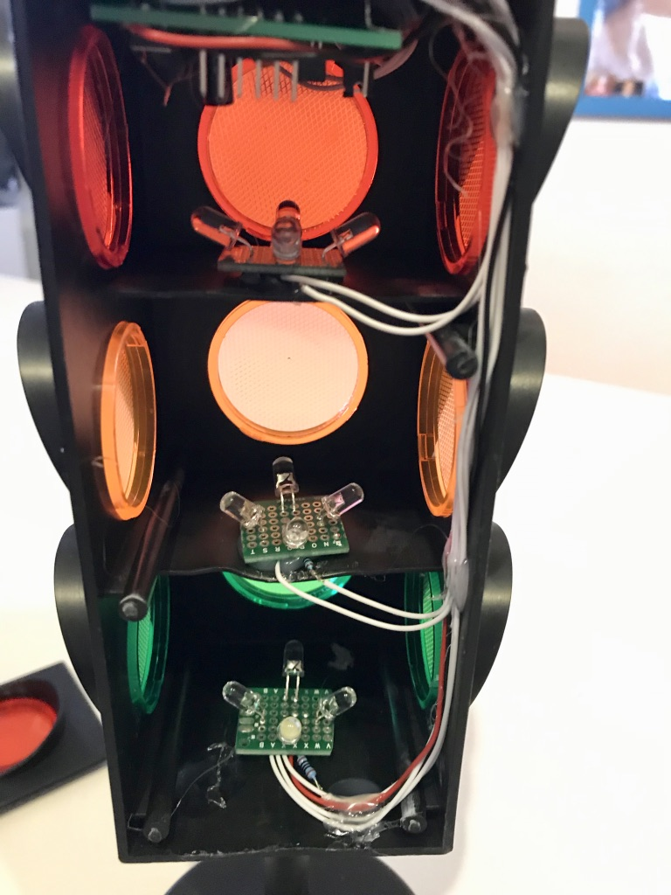

# Add WiFi Capabilities to a LED traffic sign 

got a kind of [gift](https://www.amazon.com/Traffic-Light-Lamp-Discontinued-Manufacturer/dp/B0001X0DTO/ref=pd_lpo_sbs_60_t_2?_encoding=UTF8&psc=1&refRID=BS7SSESZWZY2FP7PSNWA) 
and decided to make a WiFi upgrade, using the ESP8266 chip.

Along the line of making the build, I decided to replace the provided LED PCB with four LEDs in red, amber 
and white (for green).

I removed the battery compartment to make room for a 752555 LiPi battery I had laying around. 
Since the battery will not last for long I added a USB charging circuit around the TP4056. There are several designs around. 
Check for PCBs with OUT- and OUT+ terminals, because they will handle charging and providing current to the chip.  

I drilled a hole in the base to allow for USB charging. I hope you have better tools and/or capabilities than me ;)

I removed the existing LED PCBs because they were to dim and had only three LEDs per PCB. The result has one LED 
for each side and I bent them to center illuminating area. 

For the LEDs I used F53GC4SR-3 (red, 5mm), F53GC4SY-3 (yellow/amber, 5mm) and F51BC4BW-20 (white, 5mm for green). 
For the white one, I added a 100Ω resistor, for red and yellow 30Ω.

I used a [PCB prototype board](https://easyeda.com/hannes-angst/ESP12F-Programming-board) I made a while back as 
base of the build and attacked the grounds of the LEDs to GPIO14, GPIO12 and GPIO13 (current sinking), 
while connecting the positive side of the LEDs to the unregulated "5V" side of the PCB. You can also attach 
them directly to the battery if you so like. You can also use transistors or MOSFETs to avoid current sinking 
or allow for current sourcing. 

I attached the already existing push button of the casing to GPIO05 using a pull-up resistor and a de-bouncing capacitor.
The software does not support it yet and I honestly have no clue what to use it for.  

After soldering all together I routed the cables along the side and attached a wire at the top where the 
PCB would be sitting. I used way to much hot glue to hold everything in place ;)

# BOM 
- AI-Thinker ESP8266 ESP-12F
- 6x 10kΩ
- HT7333-1 (5v to 3.3V) 
- tactile switch button
- A slide switch for programming
- 3x 100nF ceramic capacitor 
- 1x 100µF electrolytic capacitor
- Male ping headers
- 4x F53GC4SR-3 (red LED, 5mm)
- 4x F53GC4SY-3 (yellow/amber LED, 5mm)
- 4x F51BC4BW-20 (white LED, 5mm)
- 2x 30Ω resistor (LED, red and yellow)
- 1x 100Ω resistor (LED, white)
- TP4056 PCB for charging the battery and providing current
- 752555 LiPo battery

#Programming
Compiling and programming the board was done with the [ESP NO-OS SDK](https://github.com/pfalcon/esp-open-sdk).

# Usage
When the ESP8266 starts up, it will reconnect to a already  configured AP. If it fails in doing do, 
or has no prior configuration it will instead start up a AP which SSID starts with `ESP` and contains its chip ID.
Use a browser and goto the [configuration site](http://192.1689.1.1) to enter your AP WPA2 PSK credentials.

When connected to the internet, the software will call a [status page](https://github.com/hannes-angst/k8s-status)
and display its status.

# Next steps
- Integrate push button from hardware
- Implement transitions, for example from red to green: (1) red, (2) yellow+red, (3) green
- Integrate a proper OFF switch for conversing battery
- Find a new supplier for the traffic sign hardware. The one referenced has discontinued the product

# Power Consumption
A quick test revealed that the used LiPo lasts for 10 hours. 
